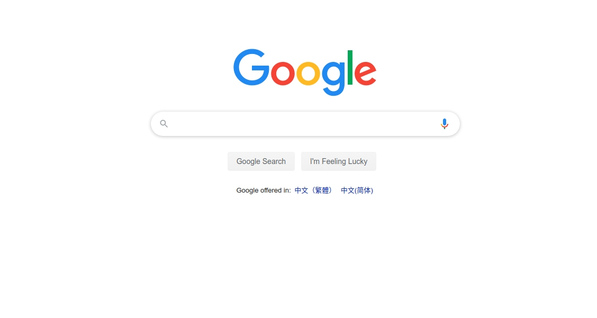

# Ubuntu下使用SSR科学上网

## 一、准备

- 操作系统：ubuntu18.04

- ssr：使用 ```electron-ssr-0.2.6```客户端
  下载地址：[点击下载](https://github.com/bryceustc/ssrForUbuntu/releases)（在release中下载，推荐使用百度网盘下载）
  
  百度网盘下载地址：[网盘地址](https://pan.baidu.com/s/1u56oUV37RYi7CtaCSV9O7Q)  密码: s5sr

## 二、安装

- 点击已经下载的` .deb`文件进行安装
- 安装完后如图

  
  
  
  
  
- 随后的操作和Windows下的操作一样，登录自己的账号就可舒舒服服的使用了google、youtube。

## 三、注意事项

- 如果登陆后没有成功的话，可能是因为PAC文件没有更新，此时在终端中使用```sudo electron-ssr```让其初始化即可。 
- 本应用内置http_proxy服务，如果您系统中或浏览器中安装有其他代理工具，服务，插件等请暂时停用或关闭服务或卸载后使用本软件。
- 本应用使用`gsetting`设置系统代理，所以有些Linux系统无法使用该功能，请参考[Ubuntu.md](https://github.com/bryceustc/ssrForUbuntu/blob/master/Ubuntu.md)手动设置系统代理。
- 火狐浏览器请注意在浏览器设置中更改代理方式为使用系统代理或手动设置。
- Chrome浏览器默认使用系统代理
